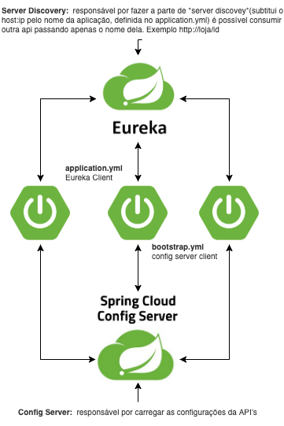
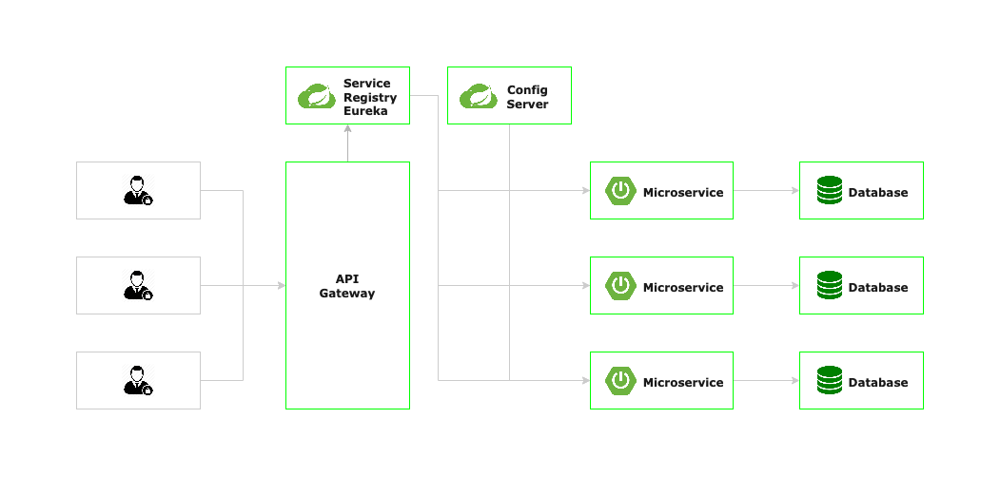

# spring-cloud



## Eureka Server
* responsável por fazer a parte de *Service Registry e Discovey*
  * subtitui o host:ip pelo nome da aplicação, definido no application.yml é possível consumir outra api passando apenas o nome dela. Exemplo http://loja/id
* adicionar a dependência do eureka server
```
    <dependency>
        <groupId>org.springframework.cloud</groupId>
        <artifactId>spring-cloud-starter-netflix-eureka-server</artifactId>
    </dependency>
```
* Habilitar o Eureka Server com @EnableEurekaServer
* No application. yml desabilitar o eureka client
* Console do Eureka, acessar pelo navegador http://localhost:8761
* Endpoits:
  * GET http://localhost:8761/eureka/apps para acessar as informações das apis que estão registradas no Eureka.
  
## Eureka Client
* Nos projetos **spring-cloud-demo-loja** e **spring-cloud-demo-usuario**
* Adicionar a dependência do eureka client
```
    <dependency>
        <groupId>org.springframework.cloud</groupId>
        <artifactId>spring-cloud-starter-netflix-eureka-client</artifactId>
    </dependency>
```
* Configurar a aplicação para que se registre no Eureka Server(application.yml)
```
eureka:
  client:
    register-with-eureka: true
    fetch-registry: true
    service-url:
      defaultZone: http://localhost:8761/eureka
```

## Config Server
* Responsável por conter as configurações(application.yml) das API's
* Adicionar a dependência do config server e do web starter
```
    <dependency>
        <groupId>org.springframework.boot</groupId>
        <artifactId>spring-boot-starter-web</artifactId>
    </dependency>
    <dependency>
        <groupId>org.springframework.cloud</groupId>
        <artifactId>spring-cloud-config-server</artifactId>
    </dependency>
```
* Habilitar o config server com **@EnableConfigServer**
* Alterar a porta para 8888
```
server:
  port: 8888
```
* Criar os arquivos de configuração:
  * Colocar o arquivo
    * **loja.yml** e **loja-dev.yml** dentro de **https://github.com/nickborges/spring-cloud/spring-cloud-api-configs/loja**
    * **usuario.yml** e **usuario-dev.yml** dentro de **https://github.com/nickborges/spring-cloud/spring-cloud-api-configs/usuario**
  * Acessando o config server: 
    * GET http://localhost:8888/loja/default ou GET http://localhost:8888/loja/dev
* Configurar o apontamento para o repositório do github
```
spring:
  cloud:
    config:
      server:
        git:
          uri: https://github.com/nickborges/spring-cloud
          search-paths: 
            - spring-cloud-api-configs/loja
            - spring-cloud-api-configs/usuario
```

## Config Server Client
* Adicionar a dependencia config client
```
    <dependency>
        <groupId>org.springframework.cloud</groupId>
        <artifactId>spring-cloud-starter-config</artifactId>
    </dependency>
```
* Criar o arquvio **bootstrap.yml** com o profile e o cloud config
  * bootstrap.yml: é o arquivo de configuração que é lido antes da aplicação subir, Exemplo: busca as configurações de banco de dados no config server.
```
spring:
  application:
    name: "loja"
  profiles:
    active: defautl
  cloud:
    config:
      uri: http://localhost:8888 #endereço do config server
```

## Client Side Load Balancer (Ribbon)
* Utilizando o RestTemplate criando um @Bean e @LoadBalancer na classe de main. Obs: É possível visualizar as instâncias com o DiscoveryClient.
* Utilizando o FeignClient, adicionar a dependência do OpenFeign, depois criar uma interface com a anotação @FeignClient e por fim habilitar na classe main o @EnableFeignClients

## Circuit Breaker e Fallback
* **Circuit breaker:** Técnica para gerênciar as transações, tempo que leva para retornar uma requisição.
* **Fallback:** Técnica para criar uma estratégia para retornar os dados caso demore muito tempo na resposta entre as requisições das API's(exempo: retornar dados do cache).
* Vantagem do Circuit Breaker, em comparação ao uso de Timeout:
  * A principal vantagem é de "cortar" a requisição caso ela demore mais do que 1 segundo para ser concluída.
  * Circuit Breaker tem como funcionalidade principal a análise das requisições anteriores, para decidir se deve parar de repassar as requisições vindas do cliente para um microsserviço com problemas de performance. Enquanto o circuito está fechado, o Hystrix continua tentando a cada 5 segundos, com o objetivo de verificar se o servidor voltou a funcionar normalmente.
* **Hystrix:**
  * o Hystrix executa uma gerência de um pool de threads.
  * "corta" a requição caso a resposta demore mais do que 1 segundo para retornar e tem o auxílio de método de fallback para tratar a resposta de retorno.
  * **Implementação:**
    * adicionar a dependência
    * habilitar o hystrix com @EnableCircuitBreaker
    * anotar o método desejado dentro do service com @HystrixCommand
    * para criar o **Fallback** basta colocar no método @HystrixCommand(fallbackMethod = "nomeDoSeuMetodoDeFallback") e depois criar o método de fallback nomeDoSeuMetodoDeFallback() para retornar os dados desejados.
    * teste, coloque o breakpoint no método anotado, e realizar diversas chamadas sem liberar o breakpoint
      * por padrão o pool de thread é 10 requisições.
    * referência: https://www.baeldung.com/spring-cloud-netflix-hystrix
* **Resilience4j:**
  * ...
  
* **Bulkhead Pattern com Hystrix:**
  * A combinação de um volume alto de requisições para um único serviço de um microsserviço pode indisponibilizar as outras requisições bulkhead é um padrão para separar o pool de threads.
  * Agrupa threads por endpoint, conforme as transações forem concluídas por exemplo em uma chamada POST, os dados já estarão disponíveis para consulta através de um GET.
  * Com Bulkhead, ganhamos mais uma funcionalidade à de processamento paralelo.
  * Pode agrupar e alocar grupos de threads para processamentos diferentes. Dessa forma, uma das chamadas de um microsserviço, que sofre lentidão por causa de uma integração com problema de performance, não indisponibiliza todas as outras chamadas do mesmo microsserviço.
  * **Implementação:**
    * anotar o método desejado dentro do service com @HystrixCommand
    * para adicionar o bulkhead basta colocar no método @HystrixCommand(threadPoolKey = "nomeDoSeuMetodo") nos métodos que são de POST e GET por exemplo.
    * teste, coloque o breakpoint no método anotado, e realizar diversas chamadas sem liberar o breakpoint.

## API Gateway - Zuul
* O Zuul utiliza o Eureka para conhecer as instâncias dos microsserviços e usando o Ribbon faz o balanceamento de carga das requisições dos usuários.
* Responsável por receber as requisições e fazer um proxy para os microserviços, livrando o client que fez a requisição de saber exatamente o endereço dos micro serviços.
* Incluir as dependências, Zuul, Eureka Discovery Client, Spring Web Starter
```
    <dependency>
        <groupId>org.springframework.boot</groupId>
        <artifactId>spring-boot-starter-web</artifactId>
    </dependency>
    <dependency>
        <groupId>org.springframework.cloud</groupId>
        <artifactId>spring-cloud-starter-netflix-eureka-client</artifactId>
    </dependency>
    <dependency>
        <groupId>org.springframework.cloud</groupId>
        <artifactId>spring-cloud-starter-netflix-zuul</artifactId>
    </dependency>
```
* Habilitar o Zull com **@EnableZuulProxy**
* Registrar o api gateway no Eureka (application.yml)
```
eureka:
  client:
    fetch-registry: true
    register-with-eureka: true
    service-url:
      defaultZone: http://localhost:8761/eureka
```
* Configurar uma rota para listar os endpoints registrados no Eureka (application.yml).
```
management:
  endpoints:
    web:
      exposure:
        include:
        - "routes"
```
* Acessar a rota que lista os endpoints: **GET http://localhost:5555/actuator/routes**
* referência: https://docs.spring.io/spring-cloud-netflix/docs/2.2.5.RELEASE/reference/html/#router-and-filter-zuul

