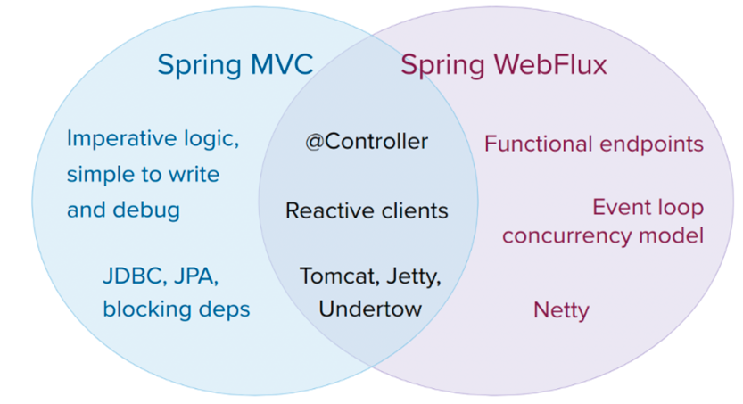
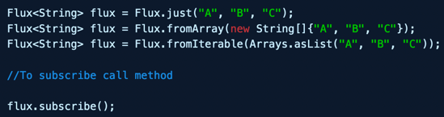
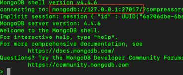

## Documentação
https://docs.spring.io/spring-framework/docs/current/reference/html/web-reactive.html

## Imperative programming vs Reactive programming


## Spring Webflux
* non-blocking reactive streams(async).
* use Netty.
* use project reactor as reactive library.
* heavily uses two publishers:
  * **Mono:** Returns 0 or 1 element.
    
    
    
  * **Flux:** Returns 0…N elements. A Flux can be endless, meaning that it can keep emitting elements forever. Also it can return a sequence of elements and then send a completion notification when it has returned all of its elements.
    
    

## MongoDB docker connection
```docker run -dti --restart unless-stopped -p 27017:27017 -v mongovolume:/u01/app/mongo/webfluxdb -e MONGO_INITDB_ROOT_USERNAME=admin -e MONGO_INITDB_ROOT_PASSWORD=admin --name webfluxdb -d mongo:latest```
```docker ps | grep mongodb```
```docker exec -it 7f8a030294b4 bash```



